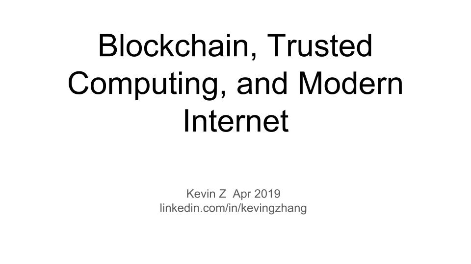
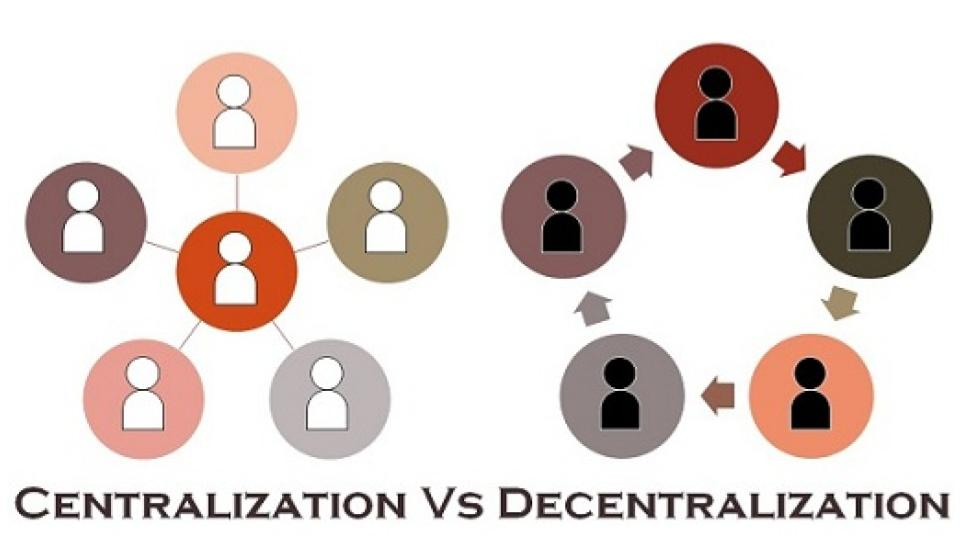
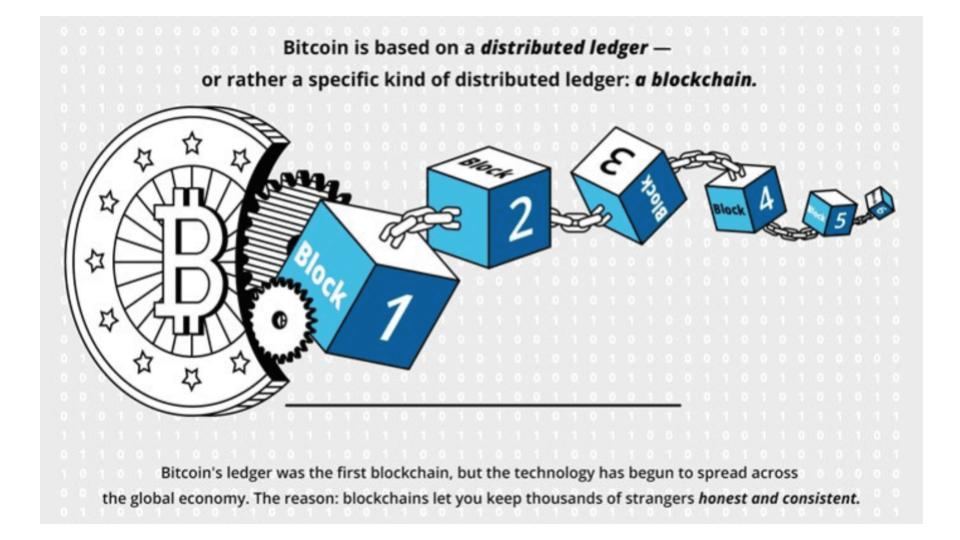
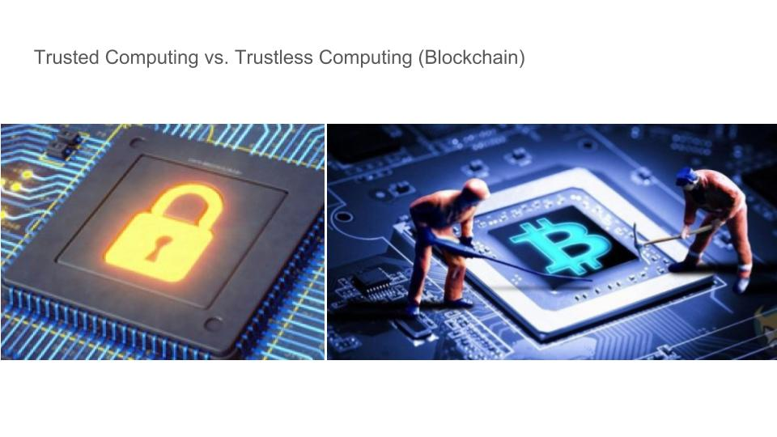
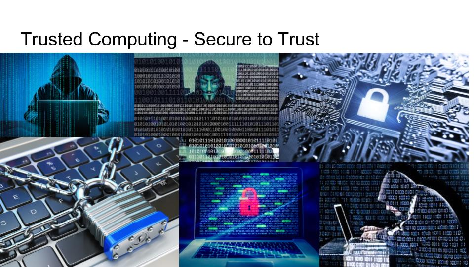
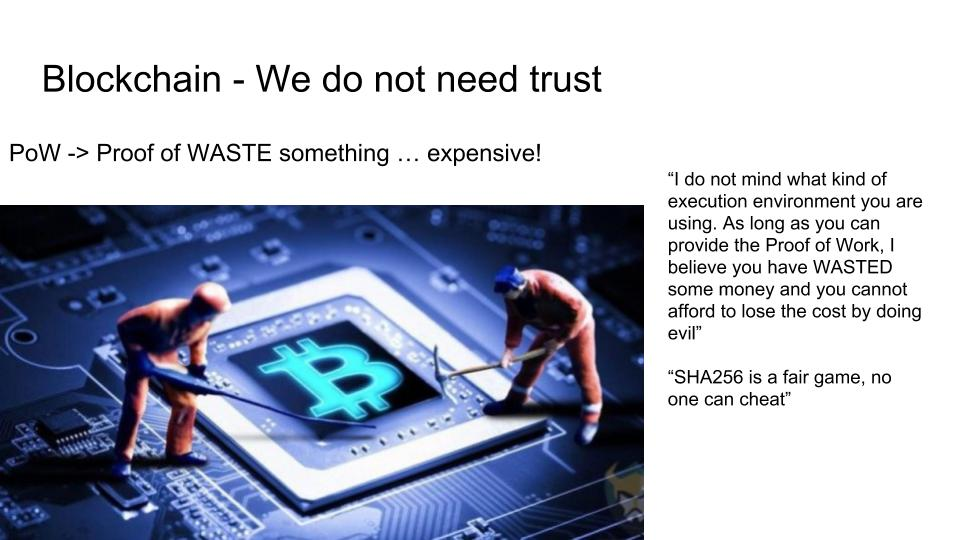
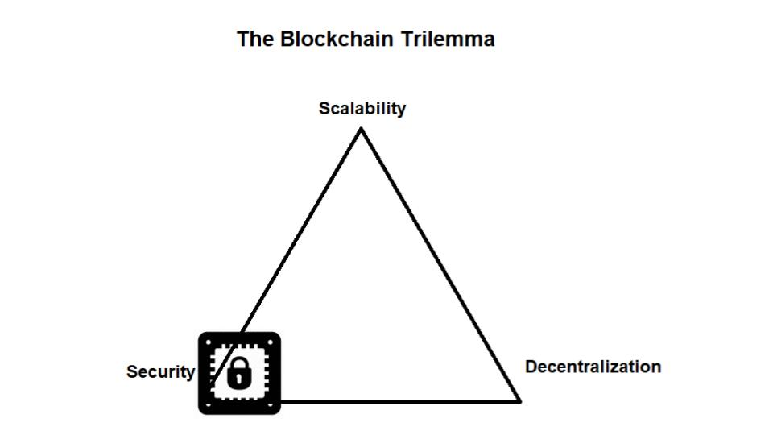
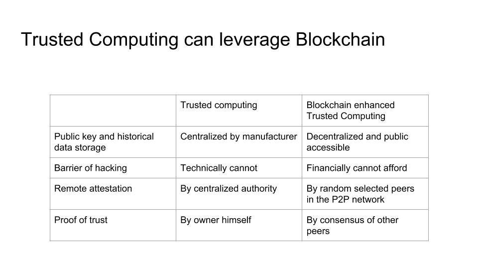
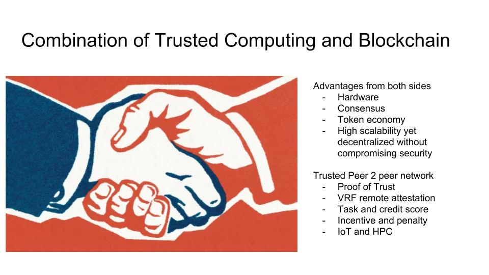

Notes: This makedown file is exported from a presentation slides which Kevin Zhang gave a talk on Apr 8, 2019. The content will be updated frequently as the idea get more and more solid. The notes are based on Kevin's presentation. 

In today's talk, due the time limitation, I probably do not have enough time to go through all the basic concepts of Blockchain and Trusted Computing. I assume you already have known those basic concepts as prerequisites. If not, I can give a brief introduction deep enough to understand today’s main topic. For the readers online, please search in wikipedia to get the basic concepts before continue. 

We are different from other animals because we trade with others for mutual benefits.

We invented money, bank, financial system. We can even trade with ourselves of the future, such as loan. 

All of those are based on one the most fundamental factor, we call it "Trust". With the protection of trust, we know we what we gain and loss during the trade. 

If there is no trust ...... well, sometime it happens.

Originally, people can only trade with people they know, beause they can trust each other. Or through a common leader, eg. a tribal chief, a king, a governement. They have the centralized power to rule and enforce the trust. It works well as long as the scale is limited to relatively small society. So, until recent, almost all of our rules are based some sort of centralized system. A good center can keep the whole system running fairly and high efficiency...until it corrupts.

So people start to find a decentralized solution. One of the most well known experiments is “Bitcoin” and the technology behind “Blockchain”.

Bitcoin is based on a distributed ledger, so called “Blockchain”. It builds trust between trustless parties. The ledger can be considered a immutable time-based append-only distributed database.

Blockchain and Trusted Computing are both solutions to solve the trustiness problem, but two very different directions.

Trusted Computing is trying to use technology (hardware, software) to guarantee integrity of system, make attacker very hard to hack technically

While on the other side, Blockchain is trying to use token economy and consensus to make attacker very expensive to attack compare with their benefits. Blockchain does NOT require nodes to trust each others, you are free to do whatever you want in your own nodes, but only follow the consensus can make you profitable. 
The first consensus is PoW used by Bitcoin for example. It is a public blockchain, anyone can use any kind of hardware to join bitcoin mining. You can do whatever in your machine, no others care about your security. As long as you can provide a Proof of Work (SHA256) faster than any others, they will follow your new block and you get reward. Bitcoin is not free of attack. As long as you own 51% hash power, you can actually control the Bitcoin. However, owning 51% of hash power is a mission impossible at this moment. 

There are pros and cons of Blockchain.
By removing the requirement of trusting other nodes’ execution environment, blockchain allow almost everyone to join and min yet still very secure. On the other hand blockchain is slow, expensive and hard to compete with existing centralized solutions. 

Recent years, there are many new blockchain projects are trying to solve the scalability problem, and some of them have made great progress. However, the Blockchain Trilemma is the physical pricinple we cannot overcome.

All of those issues are rules by the Blockchain Trilemma principle. 
You can only mostly get two of those three dimensions - “Scalability”, “Decentralization” and “Security”. For example, if you want to get both Security and Decentralization, you must compromise on Scalability. This is why Bitcoin is so slow, only about 7 TPS. Other blockchain projects can gain both Security and Scalability by compromising some of Decentralization. 
No one want to compromise Security, because everyone agree this is the most important dimension. But….

What if...

What if we “shift” the security load from the software consensus to hardware based trusted computing technologies. In this case, we actually did NOT compromise security, just use some existing Trusted Computing technologies to “take care of” security. In this case, the consensus can be much simple and faster, because it can care less about security and focus on scalability and decentralization.

We can actually get both scalability and decentralization without actually compromise security with only one new assumption: The Trusted Computing. 
This is how blockchain leverage the trusted computing. Let’s see how trusted computing can leverage blockchain in next slide

The benefits lay on both sides, Not only the Blockchain leverage Trust Computing. On the other side, Trusted Computing can also gain a lot of Blockchain.
Today’s Trusted Computing is heavily depends on TPM manufacture and very centralized too. Blockchain was born to be decentralized. We can store the ID key to the public distributed ledger. Every 2nd layer nodes are required to store their PCR and verification signature to the blockchain so that others can easily check the historical data and credit score. 
Because the blockchain is immutable. The data stored on the blockchain is trustable.

Both Blockchain and Trusted Computing can leverage from other side. 

While gain so much, we cannot say we have nothing to lose. However there are something we can debate.

We will need some kind of hardware support because the root of trust is based on the TPM. If we cannot trust TPM, then the whole story makes no sense. Someone may say the original blockchain spirit is fair to everyone (PoW for example). But think this way, if you do not have a ASIC mining machine, how much chance you can beat those mining pool in the hash power competition? Price of electricity is also another core competition factor. I do not think it is a fair game any more. PoS? Yes, you know rich get richer rule, right?

On the other hand, the TPM and hardened software on chips could be very cheap in mass production. Everyone may get a chance to own and operate on one. What compete is no longer money and power consumption, but time and credit history. 

With the requirement on the hardware can we still claim to be permissionless? My opinion is as long as the protocol is open, the consensus is open. Every hardware manufacturer can join the competition, there won’t be any discrimination. It is still permissionless and open to public, as long as you can bring a valid proof of trust as anyone else did.

Because the PCR and other security related information will be stored to the blockchain, will it cause leaking vulnerability information?
Well, first, the data stored in blockchain is always encrypted, not plain text. Second, only VRF selected remote attestators can ask to get keys to validate those information. Without valid VRF proof, the verifiee can reject the remote attestation request. So not everyone has the right to access those security related information. On the other hand, if any node is detected untrustable, it will be kicked out from the p2p network, and will not get the chance to do valuable tasks. Only trusted node can access to valuable secured tasks.

# To be continue

